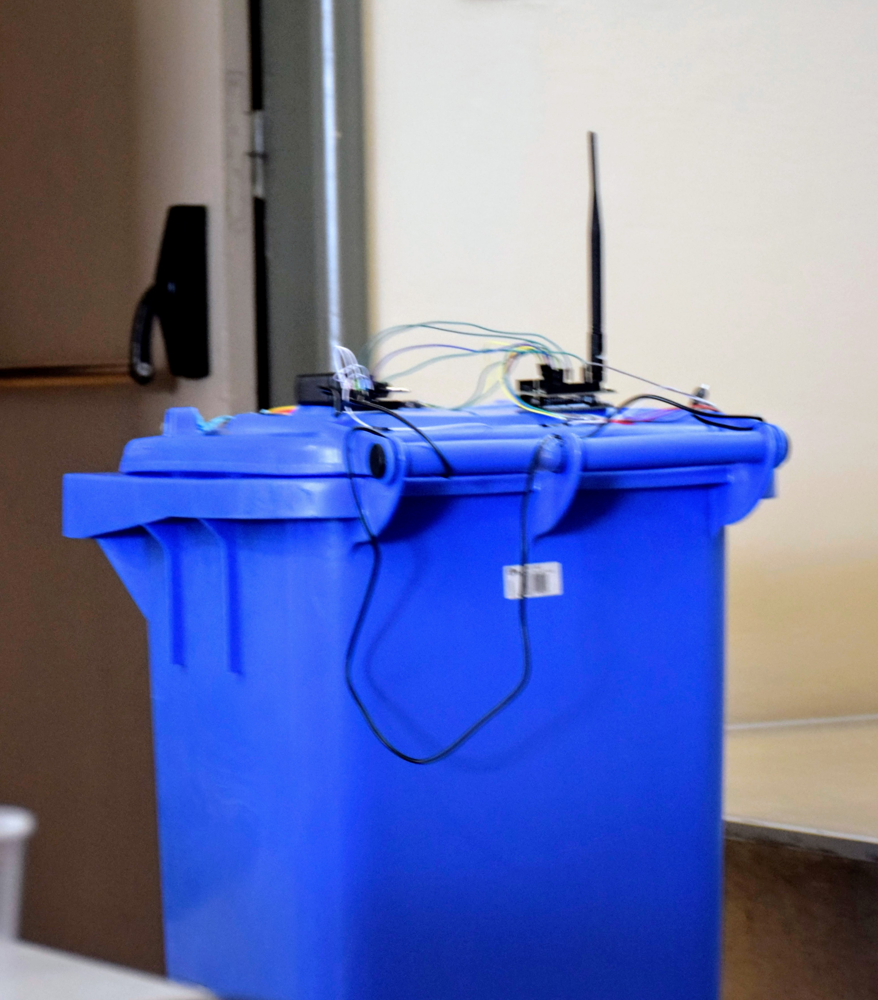

# LoRa Connected IoT Smart Trash Can Monitoring System

<p align="center">

</p>


This project is an Arduino-based system for monitoring the fill level of a trash can. It utilizes an ultrasonic sensor (HC-SR04) to measure the distance to the trash, and a touch sensor to detect when the trash can is opened. The fill level is then displayed using RGB LEDs, and the data is transmitted via LoRaWAN protocol.This project involves an Arduino UNO, an ultrasonic sensor (HC-SR04), three LEDs (green, blue, red), a touch sensor, and an EBI LoRaWAN module to monitor and communicate the fill level of a trash bin.

## Components

- Arduino UNO
- Ultrasonic Sensor HC-SR04
- Green LED
- Blue LED
- Red LED
- Touch Sensor
- EBI LoRaWAN Module

## Diagram
```
Arduino UNO:
  +---------------------------------------+
  |                                       |
  |                +-----+                |
  |                | USB |                |
  |                +-----+                |
  |  [ ]D13                        D12[ ] |
  |  [ ]D11                        D10[ ] |
  |  [ ]D9                         D8[ ]---[220Ω]---|>|---GND (Green LED)
  |  [ ]D7                         D6[ ]---|          |
  |  [ ]D5                         D4[ ]---[220Ω]---|>|---GND (Red LED)
  |  [ ]D3 (Touch Sensor)          D2[ ]---[220Ω]---|>|---GND (Blue LED)
  |  [ ]D1                         D0[ ] |
  |  [ ]GND                      RST[ ] |
  |  [ ]RST                      TX1[ ] |
  |  [ ]Vin                      RX0[ ] |
  |  [ ]5V                        GND[ ] |
  |  [ ]GND                      AREF[ ] |
  |  [ ]A0                       A1[ ] |
  |  [ ]A2                       A3[ ] |
  |  [ ]A4                       A5[ ] |
  |  [ ]A6                       A7[ ] |
  |  +-----------------------------------+

HC-SR04 Ultrasonic Sensor:
  +---------------------+
  |    HC-SR04          |
  |                     |
  |  VCC    GND         |
  |   |      |          |
  |  Trig   Echo        |
  +---------------------+
 
Connections:
  - Arduino 5V to HC-SR04 VCC
  - Arduino GND to HC-SR04 GND
  - Arduino Digital Pin 5 to HC-SR04 Trig
  - Arduino Digital Pin 6 to HC-SR04 Echo
  - Arduino Digital Pin 2 to Blue LED (with 220Ω resistor)
  - Arduino Digital Pin 8 to Green LED (with 220Ω resistor)
  - Arduino Digital Pin 4 to Red LED (with 220Ω resistor)
  - Arduino Digital Pin 3 to Touch Sensor

EBI LoRaWAN Module:
  - Connect VCC and GND to appropriate power and ground pins.
  - Connect the required communication pins based on the EBI LoRaWAN module's documentation.
```

## Breadboard Diagram
```
Breadboard
+---------------------------------------------------------+
|                                                         |
| [GND]--------------------------------------------------+|
| [5V]---+-----------------------------------------------+|
|        |                                               ||
|        |   +---------+                                 ||
|        |   |  HC-SR04 |                                ||
|        |   |         |                                 ||
|        |   |  VCC    |-------------------------------5V||
|        |   |  GND    |-------------------------------GND||
|        |   |  Trig   |--------------------------Digital5||
|        |   |  Echo   |--------------------------Digital6||
|        |   +---------+                                 ||
|        |                                               ||
|        +-----+                                         ||
|              |                                         ||
|        [220Ω]|   [LED]----GND                          ||
|   Digital 2--+                                         ||
|              |                                         ||
|        [220Ω]|   [LED]----GND                          ||
|   Digital 8--+                                         ||
|              |                                         ||
|        [220Ω]|   [LED]----GND                          ||
|   Digital 4--+                                         ||
|              |                                         ||
| [Touch Sensor]                                         ||
|   Digital 3--+                                         ||
|                                                         |
+---------------------------------------------------------+
```

## Features

1. **Trash Fill Level Monitoring**: The ultrasonic sensor measures the distance to the trash, and the fill level is displayed using the RGB LEDs. The LEDs indicate the fill level as follows:
   - Blue LED: Low fill level
   - Green LED: Medium fill level
   - Red LED: High fill level

2. **Touch Sensor Integration**: The touch sensor is used to detect when the trash can is opened. When the trash can is opened, the system will send a message indicating that the trash can is open.

3. **LoRaWAN Connectivity**: The system uses LoRaWAN protocol to transmit the fill level data to a remote server or monitoring system. This allows for remote monitoring and tracking of the trash can's status.

4. **JSON Data Transmission**: The project uses the ArduinoJson library to handle the JSON data for the LoRaWAN communication. The fill level data is sent as a JSON object with a `fullness` field.

## Usage

1. Connect the components to the Arduino UNO as follows:
   - Ultrasonic sensor:
     - Trigger pin to Arduino pin 5
     - Echo pin to Arduino pin 6
   - RGB LED:
     - Blue LED to Arduino pin 2
     - Green LED to Arduino pin 8
     - Red LED to Arduino pin 4
   - Touch sensor to Arduino pin 3

2. Upload the provided Arduino code to the board.

3. The system will start monitoring the trash can's fill level and transmitting the data via LoRaWAN. The RGB LEDs will display the current fill level.

4. When the trash can is opened, the system will send a message indicating that the trash can is open.

## Example: Using ArduinoJson

The project uses the ArduinoJson library to handle the JSON data for the LoRaWAN communication. Here's an example of how the `sendData()` function is implemented:

```cpp
void sendData(int fullnessPercentage) {
   Serial.print("Full: ");
   Serial.println(fullnessPercentage);
   Serial.print(" %");

   Serial.println("Sending new data...");

   StaticJsonDocument<200> doc;
   doc.clear();
   doc["fullness"] = fullnessPercentage;

   // Serialize the JSON document to a byte array
   size_t length = serializeJson(doc, rxBuffer, sizeof(rxBuffer));

   if (EBIES_Success == hEbi.sendBytes(rxBuffer, length, 6)) {   // Send data using FPort=6
     Serial.print("Success! (ACK RSSI = ");
     Serial.print(hEbi.getLastTxAckRSSI());
     Serial.println(" dBm)");
   } else {
     Serial.println("Failed");
   }

   // Check if DL data is available
   int dl_length = hEbi.available(1000); // Wait for 1 second for DL data
   if (dl_length > 0) {
      int datalength = hEbi.readBytes(rxBuffer, dl_length);
      Serial.print("Received Data: ");
      DeserializeJson(doc, rxBuffer, datalength);
      serializeJsonPretty(doc, Serial);
      Serial.print(" (RSSI = ");
      Serial.print(hEbi.getLastRxRSSI());
      Serial.println(" dBm)");
   }
}
```

In this example, we create a JSON document using the `StaticJsonDocument` class from the ArduinoJson library. We then add the `fullness` field to the document with the `fullnessPercentage` value. The JSON document is then serialized to a byte array and sent over LoRaWAN using the `hEbi.sendBytes()` function.

When receiving data, we deserialize the received bytes into the JSON document using `DeserializeJson()`, and then pretty-print the JSON data to the serial monitor.

## Configuration

The Arduino code includes the following configurable parameters:

- `thresh`: An array of three threshold distances (in cm) that define the fill level ranges for the RGB LEDs.
- LoRaWAN configuration:
  - `AppSKey`: Application Session Key
  - `NetSKey`: Network Session Key
  - `DevAddress`: Device Address

Make sure to update these parameters with the appropriate values for your LoRaWAN network.

## Contribution

If you have any suggestions or improvements, feel free to contribute to the project by submitting a pull request.
